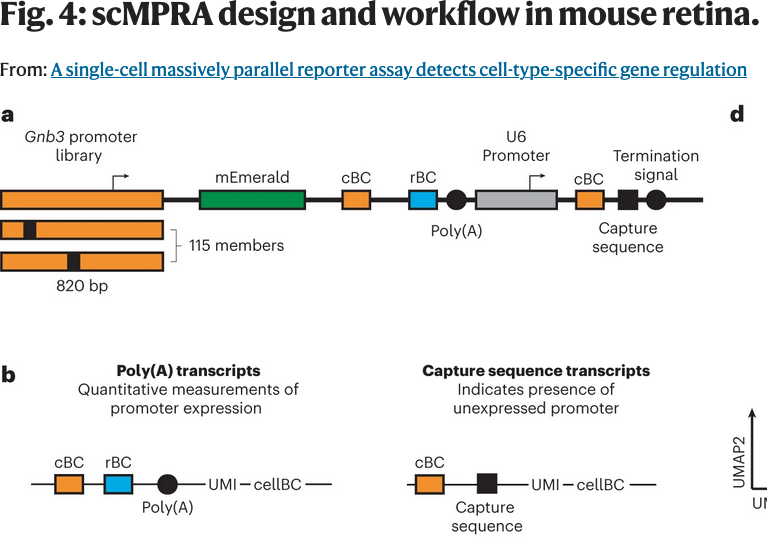

Let us check which read lengths are paired.

```bash
DATA_ROOT="/home/mcn26/palmer_scratch/raw_recap/cohen_retina/filtered_fastq/"
```




# U6

## retina u6 barcodes rep2

(Filtering to lines with read information which start with @)
(Space delimited field 3 is length)
```bash
cat ${DATA_ROOT}SRR21787460_1.filtered.fastq | grep '^@' | cut -d' ' -f3 > SRR21787460_1 &
cat ${DATA_ROOT}SRR21787460_2.filtered.fastq | grep '^@' | cut -d' ' -f3 > SRR21787460_2 &
```

```bash
paste SRR21787460_1 SRR21787460_2 | sort | uniq -c > SRR21787460_lens.txt
cat SRR21787460_lens.txt
```

```output
11552805 length=28      length=100
 481945 length=28       length=150
114259345 length=28     length=44
```

## retina u6 barcodes rep1

```bash
cat ${DATA_ROOT}SRR21787461_1.filtered.fastq | grep '^@' | cut -d' ' -f3 > SRR21787461_1 &
cat ${DATA_ROOT}SRR21787461_2.filtered.fastq | grep '^@' | cut -d' ' -f3 > SRR21787461_2 &
```

```bash
paste SRR21787461_1 SRR21787461_2 | sort | uniq -c 
```

```output
12024264 length=28      length=100
 515780 length=28       length=150
111496533 length=28     length=44
```

## interpretation

![../images/chromium.png]

Looks like the normal 28bp fwd... Not sure why the reverse has multiple read lengths.

# main MPRA bc

## retina barcodes rep2

```bash
cat ${DATA_ROOT}SRR32774353_1.filtered.fastq | grep '^@' | cut -d' ' -f3 >  SRR32774353_1 &
cat ${DATA_ROOT}SRR32774353_2.filtered.fastq | grep '^@' | cut -d' ' -f3 >  SRR32774353_2 &
```

```bash
paste SRR32774353_1 SRR32774353_2 | sort | uniq -c
```

```output
313744483 length=28     length=100
```

## retina barcodes rep1

```bash
cat ${DATA_ROOT}SRR21787462_1.filtered.fastq | grep '^@' | cut -d' ' -f3 >  SRR21787462_1 &
cat ${DATA_ROOT}SRR21787462_2.filtered.fastq | grep '^@' | cut -d' ' -f3 >  SRR21787462_2 &
```

```bash
paste SRR21787462_1 SRR21787462_2 | sort | uniq -c
```

```
347385162 length=28     length=100
```

## interpretation

28/100 Makes perfect sense for the poly-A library. 
