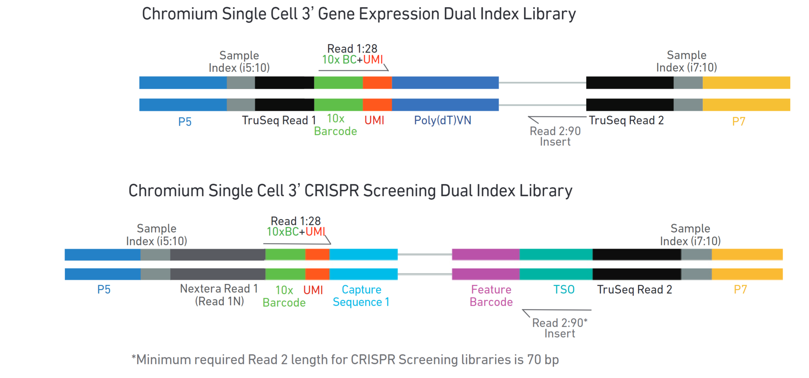

Let's examine the consensus sequences we just generated from the cohen retina scMPRA sequencing data and see if we can understand them and so extract the relevant barcodes...

# reference


Chromium diagram:


TSOs from [10x docs](https://kb.10xgenomics.com/hc/en-us/articles/360001493051-What-is-a-template-switch-oligo-TSO). 
```
CCCATGTACTCTGCGTTGATACCACTGCTT
```

```
TTTCTTATATGGG
```

# Normal MPRA

Examining the crispr screening regular dual index library (top diagram) & fig 4b left, I expect the read structure to be

```
5' [10x cbc] [UMI] [poly dT VN] [] [] 3'
```

**All forward reads:** 
- SRR21787462_1.filtered.fastq_28nt.txt.stats
- SRR32774353_1.filtered.fastq_28nt.txt.stats
```
NNNNNNNNNNNNNNNNNNNNNNNNNNNN
NNNNNNNNNNNNNNNNNNNNNNNNNNNN
```

So that's `[10x cbc] [UMI]`, and it's exactly 28 bp, as expected!

**All reverse reads:**
- SRR32774353_2.filtered.fastq_100nt.txt.stats
- SRR21787462_2.filtered.fastq_100nt.txt.stats

```
GAGCTGTACAAGTAACTGCGATMNNNNNNNAAGGAACCCGCGCTATACCGGTATCGCNNNNNNNNNNNNNNNNNNNNNNNNGGCCGCTAAGATACATTGA
GAGCTGTACAAGTAACTGCGATMNNNNNNNAAGGAACCCGCGCTATACCGGTATCGCNNNNNNNNNNNNNNNNNNNNNNNNGGCCGCTAAGATACATTGA
```


# U6

Examining the crispr screening dual index library (bottom diagram) & fig 4b right, I expect the read structure to be

```
5' [10x cbc] [UMI] [Capture sequence] [cBC] [] 3'
```

**All forward reads:**
- SRR21787460_1.filtered.fastq_28nt.txt.stats
- SRR21787461_1.filtered.fastq_28nt.txt.stats

```
NNNNNNNNNNNNNNNNNNNNNNNNNNNN
NNNNNNNNNNNNNNNNNNNNNNNNNNNN
```

**All reverse reads:**
- SRR21787461_2.filtered.fastq_44nt.txt.stats
- SRR21787461_2.filtered.fastq_100nt.txt.stats
- SRR21787460_2.filtered.fastq_100nt.txt.stats
- SRR21787460_2.filtered.fastq_44nt.txt.stats
- SRR21787461_2.filtered.fastq_150nt.txt.stats
- SRR21787460_2.filtered.fastq_150nt.txt.stats

```
CCGGTAAGCTCCCGGGAGCTTGTMNNNNNNNGCTTTAAGGCCGG
CCGGTAAGCTCCCGGGAGCTTGTMNNNNNNNGCTTTAAGGCCGGTCCTAGCAANNNNNNNNNNNNNNNNNNNNNNNNNNNNCTGTCTCTTATACACATCT
CCGGTAAGCTCCCGGGAGCTTGTMNNNNNNNGCTTTAAGGCCGGTCCTAGCAANNNNNNNNNNNNNNNNNNNNNNNNNNNNCTGTCTCTTATACACATCT
CCGGTAAGCTCCCGGGAGCTTGTMNNNNNNNGCTTTAAGGCCGG
CCGGTAAGCTCCCGGGAGCTTGTMNNNNNNNGCTTTAAGGCCGGTCCTAGCAANNNNNNNNNNNNNNNNNNNNNNNNNNNNCTGTCTCTTATACACATCTGACGCTGCCGACGATATAATCCGAGTGTAGATCTCGGTGGTCGCCGTATC
CCGGTAAGCTCCCGGGAGCTTGTMNNNNNNNGCTTTAAGGCCGGTCCTAGCAANNNNNNNNNNNNNNNNNNNNNNNNNNNNCTGTCTCTTATACACATCTGACGCTGCCGACGATTGGCACTCGGTGTAGATCTCGGTGGTCGCCGTATC
```

Interesting. If we line them all up they match. Why exactly were there multiple read lengths ...?


